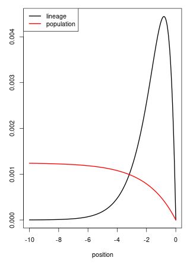

# The "problem" of geography

a map

##

tobler's law

## "Isolation by distance"

definition of genetic distance

## coalescence time

if mutations are Poisson,

P(mut before coal)

= int P(mut before nearby at x) * P(mut before coal | nearby at x) dx

## Wright-Malecot

formula, in 2d

What's sigma eff and Nloc?

## Tracing back lineages

definition of $L_t$

stationary distribution is long-term fitness

motion determines decay of relatedness somehow

# Questions:

Let $\sigma^2_e = \lim_{t \to \infty} \mathbb{E}[L_t^2]$.

What determines the sign of $\sigma_e - \sigma$?

How *does* $L_t$ move, anyhow?

# A discrete model

Discrete space and time,
but varying population sizes.

Goal: understand sources of variation.

(picture of a plant)

## 

Suppose:
$$\begin{aligned}
    N(x,t)
        &= \text{(number of individuals $t$ generations ago at $x$)} \\
    m(x, y)
        &= \text{(proportion of seeds from $x$ that go to $y$)}
\end{aligned}$$

... and surviving individuals are uniform choices out of available seeds.

. . .

and so
$$\begin{aligned}
    \P\{ L_{t+1} = y \;|\; L_t = x \}
        &= \frac{ N(y,t) m(y, x) } { \sum_z N(z,t) m(z, x) } .
\end{aligned}$$

# Big/small worlds

## Much, much simpler:

Assume that:

0. We're in one dimension.
1. $L_t$ is Markov given $N$ (generally requires $N$ to be large).
2. $N(x,t)$ is reversible, Markov, and stationary.
3. $N(x,t) \in \{G, B\}$, with $G \gg B$.
4. $m(x,y) = 1/3$ if $|x-y| \le 1$.

. . .

$$\begin{aligned}
    \text{Note: } \sigma^2 = \frac{2}{2} .
\end{aligned}$$

. . . 

Then $L_{t+1} \; | L_t = x$

- chooses a neighboring "good" patch uniformly, if available;
- if not, chooses a neighboring patch uniformly.

## Case 1: no temporal correlations

Suppose 
- $N(t, \cdot)$ is independent for each $t$, and
- $N(t, x)$ is Markov in $x$ with transition matrix
$$\begin{aligned}
    P = \bordermatrix{  & G & B \cr
                  G & 1-p & p \cr
                  B & q & 1-q \cr
                 }
\end{aligned}$$

---------------------

\begin{tabular}
    habitat    & probability  &  $(\Delta L)^2$ \\
    \hrule
    GGG        &   \frac{p}{p+q} (1-q)^2   & 2/3 \\
    GGB/BGG    &   \frac{p}{p+q} (1-q)q    & 1/2 \\
    GBB/BBG    &   \frac{p}{p+q} q(1-p)    & 1 \\
    GBG        &   \frac{p}{p+q} qp        & 1 \\
    BGB        &   \frac{q}{p+q} pq        & 0 \\
    BBB        &   \frac{q}{p+q} (1-p)^2   & 2/3 \\
\end{tabular}

$$\begin{aligned}
    \E[(L_1 - L_0)^2]
    =
    \frac{2}{3} + \frac{ pq } {3 (p + q) } \left(1 - (p + q)\right) .
\end{aligned}$$

---------------------

$$\begin{aligned}
    \var{L_1} = \frac{2}{3} + \frac{ pq } {3 (p + q) } \left(1 - (p + q)\right) .
\end{aligned}$$
and so
$$\begin{aligned}
    \sigma_e > \sigma \qquad \text{iff} \quad p + q < 1,
\end{aligned}$$

. . .

i.e., iff
- $P$ has only positive eigenvalues.
- the environment does not oscillate.

##

the random environment can *either* slow down *or* speed up a lineage

even with *no* temporal correlations!

# A model for diffusion limits

Now let's move to *continuous space*.

## The model:

Birth, establishment, and establishment rates
depend on local population densities (like Bolker-Pacala):

- $N$: scaling factor for density
- $\eta_t$: point measure with $1/N$ for each individual
- $\epsilon$: interaction distance
- $\bar \eta_t = p_\epsilon * \eta_t / N$: rescaled, smoothed population density
- $p_\epsilon$: the heat kernel
- $\gamma(x, \bar \eta_t(x))$: per capita birth rate at $x$
- $q(x, y)$: probability density a juvenile disperses to $y$
- $r(y, \bar \eta_t(y))$: juvenile establishment probability at $y$
- $\mu(x, \bar \eta_t(x))$: death rate at $x$

## For instance

*Mortality increases with crowding:*
$\gamma$ and $r$ are constant,
while
$$\begin{aligned}
    \mu(x, u)
    &= \mu_0 \left( 1 - \frac{1}{1 + \exp(u)} \right) .
\end{aligned}$$

## Or, for instance

*Fecundity decreasing with crowding:*
$\mu$ and $r$ are constant,
while
$$\begin{aligned}
    \gamma(x, u)
    &= \gamma_0 \left( \frac{1}{1 + \exp(u)} \right) .
\end{aligned}$$

## How's the density change?

$$\begin{aligned}
    & \hphantom{\int} \; N \bar \eta(y) \gamma(y, \bar \eta) \; \hphantom{q(y, dx)} &\qquad &\text{(birth at $y$)} \\
    & \int \; \hphantom{N \bar \eta(y) \gamma(y, \bar \eta)} \; q(y, dx) r(x, \bar \eta) &\qquad &\text{(dispersal to $x$)}
\end{aligned}$$

**and**

$$\begin{aligned}
    & {} - N \bar \eta (x) \mu(x, \bar \eta)  & \qquad &\text{(death)}
\end{aligned}$$

## The mean measure

So: for a test function $f$,
$$\begin{aligned}
    &
    \lim_{dt \searrow 0} \frac{1}{dt}
        \left. \mathbb{E} \left[
            \int f(x) \bar \eta_{dt}(dx) - \int f(x) \bar \eta_0(dx)
        \;|\; \bar \eta_0 = \bar \eta \right] \right\vert_{t=0} \\
    &\qquad
    = \int \int f(z) r(z, \bar \eta) q(x, dz) \gamma(x, \bar \eta) \bar \eta(dx) \\
    &\qquad \qquad {}
    - \int f(x) \mu(x, \bar \eta) \bar \eta(dx) .
\end{aligned}$$

. . .

$$\begin{aligned}
    &{}
    = \int \left\{ \int \left( f(z) r(z, \bar \eta) 
                              - f(x) r(x, \bar \eta) \right) 
                         q(x, dz) \right\}
             \gamma(x, \bar \eta) \bar \eta(dx) \\
    &\qquad \qquad {}
    + \int f(x)
        \left\{
            r(x, \bar \eta) \gamma(x, \bar \eta)
            - \mu(x, \bar \eta)
        \right\}
      \bar \eta(dx) .
\end{aligned}$$

# Limits

------------

Rescale *time* by $\theta$.
As $\theta \to \infty$:

. . .

to see *lineages* moving, we need
variance of dispersal distance of $1/\theta$, and
$$
    \theta \int g(y) q_\theta(x, dy) \to \Delta g(x)
$$

. . .

Suppose the *density measure* converges:
$$
    \bar \eta_\theta \to \Xi
$$

. . .

Long-term behavior is "near equilibrium":
$$
    \theta\left(
        r(x, \bar \eta) \gamma(x, \bar \eta)
        - \mu(x, \bar \eta)
    \right)
        \to F(x, \Xi) .
$$

--------------

and so as $\theta \to \infty$,
$$\begin{aligned}
    &
    \lim_{dt \searrow 0} \frac{1}{dt}
        \left. \mathbb{E} \left[ \int f(x) \bar \eta_{dt}(dx) - \int f(x) \bar \eta_0(dx) \;|\; \bar \eta_0 = \bar \eta \right] \right\vert_{t=0} \\
    &\qquad
    \to
        \int \gamma(x, \Xi) \Delta\left(
                f(\cdot) r(\cdot, \Xi)
            \right)(x) \Xi(dx) \\
    &\qquad \qquad {}
    + \int f(x) F(x, \Xi) \Xi(dx) .
\end{aligned}$$

## What about noise?

If reproduction is Poisson:

$$\begin{aligned}
    &
    \lim_{dt \searrow 0} \frac{1}{dt}
        \left. \mathbb{E} \left[
                \left( \int f(x) \bar \eta_{dt}(dx) - \int f(x) \bar \eta_0(dx) \right)^2
            \;|\; \bar \eta_0 = \bar \eta \right] \right\vert_{t=0} \\
    &\quad {}
    = \frac{\theta}{N}
    \left\{
        \int \gamma(x, \bar \eta)
            \int f^2(y) r(y, \bar \eta) q(x, dy)
        \bar \eta(dx)
    \right. \\
    &\qquad \qquad \left. {}
    + \int \mu(x, \bar \eta) f^2(x) \bar \eta(dx)
    \right\} 
\end{aligned}$$

. . .

$$\begin{aligned}
    &\quad {}
    \propto \frac{\theta}{N} .
\end{aligned}$$

## When is the limit stochastic?

Quadratic variation of the limit is nonzero if
$$ N = \rho \theta $$
for some $\rho > 0$.

. . .

In other words,
since dispersal distance is $1/\sqrt{\theta}$:
$$\begin{aligned}
    N_\text{loc}
    &:= \text{(mean number of individuals within distance $1/\sqrt{\theta}$)} \\
    &\propto N / \theta \\
    &= \rho .
\end{aligned}$$

. . .

... i.e., if Wright's neighbhood size is finite in the limit.

## Deterministic limits: $\theta/N \to 0$

If the limiting measure has density $\Xi_t(x) dx$,
then it's a weak solution to
$$\begin{aligned}
    \frac{d}{dt} \Xi_t(x)
    &=
        r(x, \Xi) \Delta\left(
                \gamma(\cdot, \Xi_t) \Xi_t(\cdot)
            \right)(x)
        + F(x, \Xi_t) \Xi_t(x) .
\end{aligned}$$

. . .

i.e.,
$$\begin{aligned}
    \dot \Xi = r \Delta\left( \gamma \Xi \right) + F \Xi .
\end{aligned}$$

## Reaction-diffusion equations?

Recall that e.g.,
$$\begin{aligned}
r(x, \Xi)
    = r(\int p_\epsilon(x, y) \Xi(dy)) .
\end{aligned}$$

. . .

... can we also take $\epsilon \to 0$, getting
$$\begin{aligned}
    \frac{d}{dt} \Xi_t(x)
    &=
        r(\Xi(x)) \Delta\left(
                \gamma(\Xi_t(\cdot)) \Xi_t(\cdot)
            \right)(x)
        + F(\Xi_t(x)) \Xi_t(x) ?
\end{aligned}$$

## What do we need to know?

With
$$\bar \eta^\epsilon \to \Xi^\epsilon \qquad \text{as } \theta \to \infty,$$
can we take $\epsilon \to 0$ also so that
$$\bar \eta^\epsilon \to \Xi ? $$

. . .

Since rates depend on $p_\epsilon * \bar \eta$, it sufficies if

1.  $p_\epsilon * \bar \eta^\epsilon \approx p_\epsilon * \Xi^\epsilon$ (convergence as $\theta \to \infty$)
2.  $p_\epsilon * \Xi^\epsilon \approx p_\epsilon * \Xi$ (needs more explicit conditions!)
3.  $p_\epsilon * \Xi \approx \Xi$ (solution is smooth)

# But, careful now...

::: {.floatright}
{width=40%}

::::: {.caption}
*Gilia Patterson*
:::::

:::

---------------------

- death: $\mu = 0.3$ per generation

- establishment: $r = 0.7$

- dispersal: Gaussian with SD $\sigma$

- local density: in circle of radius $\epsilon$

- reproduction: with $K=2$, $\lambda=3$,
$$ \gamma = \frac{\lambda}{1 + \text{(local density)}/K} $$

- non-spatial equilibrium density:
$$ K \left( \frac{\lambda}{1 - r} - 1 \right) .$$

. . .

Try it out yourself: SLiM code at [github.com/petrelharp/cirm_2021_talk](https://github.com/petrelharp/cirm_2021_talk/gilia_clumping_sim.slim)

---------------------

-  dispersal distance $\sigma = 1/\sqrt{\theta} = 3$
-  interaction distance $\epsilon = 1$

. . .

---------------------

-  dispersal distance $\sigma = 1/\sqrt{\theta} = 0.2$
-  interaction distance $\epsilon = 1$
-  mean # offspring $\gamma \propto (1 + \text{(density)} / K)^{-1}$

. . .

-----------------

::: {.centered}

:::

# What about the lineages?

----------

**Goal:** obtain a large-$N$ scaling limit of population density
that *retains the notion of lineages*, in three cases:

1. superprocess
2. deterministic, nonlocal coefficients
2. deterministic, local coefficients

. . .

**Method:** a lookdown construction,
following [Kurtz & Rodrigues 2011](https://dx.doi.org/10.1214/10-AOP574)
and [Etheridge & Kurtz 2019](https://dx.doi.org/10.1214/18-AOP1266).

## Deterministic, nonlocal coefficients:

*Theorem:* Suppose that 
$$\begin{aligned}
    r(x, \bar \eta) &= r(x), \qquad \text{twice diff'able} \\
    \gamma_\theta(x, \bar \eta)
        &= \gamma(p_\epsilon * \bar \eta(x))
            + \frac{G(p_\epsilon * \bar \eta(x))}{\theta r(x)} \\
    \mu_\theta(x, \bar \eta)
        &= \mu(p_\epsilon * \bar \eta(x))
            + \frac{H(p_\epsilon * \bar \eta(x))}{\theta} \\
    q_\theta(x, dy) &= p_{1/\theta}(x, dy) ,
\end{aligned}$$
with $\gamma$, $G$, $H$, and $r$ uniformly bounded and Lipschitz continuous.
Then a lookdown construction with maximum level $N \to \infty$,
if $\theta(N) / N \to 0$,
converges in the sense of finite-dimensional distributions
to a measure-valued process $(\eta_t^\infty)_{t \ge 0}$.

## (theorem, continued)

The limit is a Cox measure with intensity a product of
$\Xi_t \times \Lambda$, and for every continuous, bounded $f : \mathbb{R}^d \to \mathbb{R}_+$,
$$\begin{aligned}
    & \int f(x) \Xi_t(dx)
      - \int f(x) \Xi_0(dx) \\
    &=
      \int_0^t \int
        \gamma(p_\epsilon * \Xi_s(x))
        \Delta \left( f(\cdot) r(\cdot) \right)(x) \\
    {}&\qquad
        + f(x) \left\{
            G(p_\epsilon * \Xi_s(x))
            - H(p_\epsilon * \Xi_s(x))
        \right\}
      \xi_s(dx) ds .
\end{aligned}$$

# Consequences for stationary landscapes

----------

If a deterministic, local limit holds,
with dispersal $N(m, \sigma^2 I)$,
lineages should move in a stationary population density $n(x) = d\Xi/dx$ as
$$\begin{aligned}
    dL_t = r(L_t) \gamma(L_t) \left\{
            \left(
                2\sigma^2 \nabla \log(n\gamma)(L_t)  - m
            \right) dt
            + \sigma dB_t \right\} .
\end{aligned}$$

. . .

i.e., as Brownian motion run at speed $\sigma \gamma(y) n(y)$
in the potential
$$\begin{aligned}
    n(y) \gamma(y) e^{-my/(2\sigma^2)} ,
\end{aligned}$$
... which has stationary distribution
$$\begin{aligned}
    \frac{n(y)}{r(y)} e^{-my/(2\sigma^2)} .
\end{aligned}$$

# Lineages in expanding populations

------------

Many population models will *expand* into unoccupied habitat, e.g.:

. . .

The classic Fisher-KPP equation:
$$\begin{aligned}
   dn = \left( \Delta n + s n (1-n) \right) dt 
\end{aligned}$$

. . .

... or, with an Allee effect:
$$\begin{aligned}
   dn = \left( \Delta n + s n (1-n) (Cn - 1) \right) dt 
\end{aligned}$$

------------

Recall that 
$$\begin{aligned}
    \dot \Xi = r \Delta(\gamma \Xi) + F \Xi ,
\end{aligned}$$
where
$$\begin{aligned}
    F(x, \Xi) = r(x, \bar \eta) \gamma(x, \bar \eta) - \mu(x, \bar \eta) .
\end{aligned}$$

. . .

So, we'd get
$$\begin{aligned}
   dn = \left( \Delta n + s n (1-n) (Cn - 1) \right) dt 
\end{aligned}$$
with $r = \gamma = 1$ and
$$\begin{aligned}
    \mu(x, n)
    =
    1 + s (n - 1) (Cn - 1) .
\end{aligned}$$

## Travelling waves

Suppose the population density has a traveling wave profile:
$$\begin{aligned}
    n(x,t) = w(x - ct)
\end{aligned}$$
and a determinstic, local limit holds:

. . .

... then $L - ct$ has generator
$$\begin{aligned}
    \phi \mapsto r(x) \gamma(x) \left(
        2 \nabla \log(\gamma w)(x) \cdot \nabla \phi(x)
        + \Delta \phi(x)
    \right) 
        \\ \qquad {}
    + c \cdot \nabla \phi(x) .
\end{aligned}$$

## Example: PME

For instance, take the porous medium equation with logistic growth (in 1D):
$$\begin{aligned}
   \partial_t n_t(x) = \partial_x^2 [n_t(x)^2] + n_t(x) (1 - n_t(x)) ,
\end{aligned}$$
with stable solution
$$\begin{aligned}
    n_t(x) = \left( 1 - \exp\left( \frac{1}{2} (x - t) \right)\right)_+
\end{aligned}$$

. . .

To get this, we want $r=1$ and
$$\begin{aligned}
    \gamma(x, n) &= n(x) \\
    \mu(x, n) &= 2 n(x) - 1 .
\end{aligned}$$

------------------

...so in the stationary frame, the lineage's generator is
$$\begin{aligned}
    \phi 
    &\mapsto 
    w(x) \left( \phi_{xx} + 4 (log w)_x \phi_x \right) + \phi_x \\
    &=
    \left(1 - e^{x/2}\right) \phi_{xx}
            + \left(1 - 2 e^{x/2}\right) \phi_x \qquad \text{on } x < 0.
\end{aligned}$$

-----------------

::: {.columns}
:::::: {.column}

The lineage has stationary distribution 
$$\begin{aligned}
    \pi(x) \propto e^x \left(1 - e^{x/2}\right) \qquad \text{for } x < 0 .
\end{aligned}$$

:::
:::::: {.column width=50%}

:::
::::::

