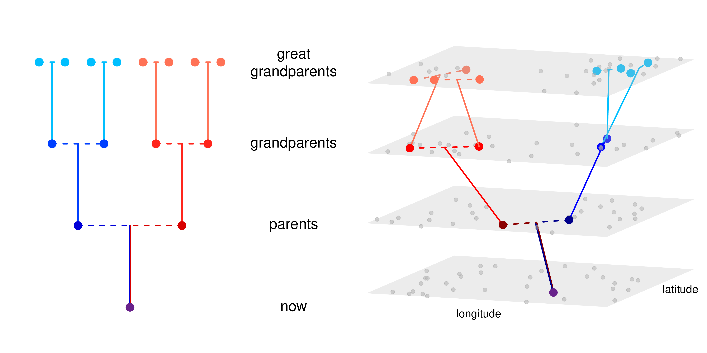
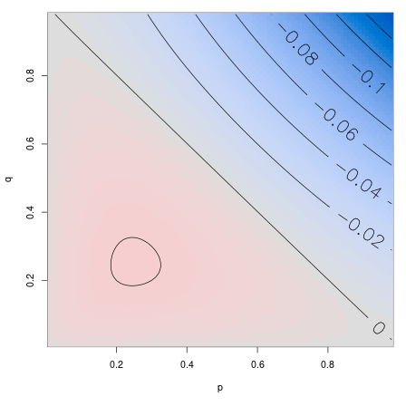
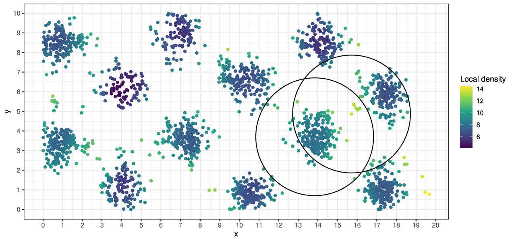
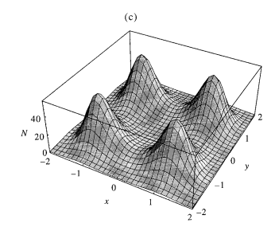

::: {.columns}
:::::: {.column}

**Joint work with:**

Alison Etheridge

Tom Kurtz

Ian Letter

Terence Tsui

:::
:::::: {.column width=50%}

:::
::::::

<!--
------------------

How can genetic data help us predict the *future*
evolution of populations?
-->

------------------

**title text:** *"On one hand, every single one of my ancestors going back billions of years has managed to figure it out.  On the other hand, that's the mother of all sampling biases."*

::: {.caption .floatright}
*[xkcd:674](https://xkcd.com/674/)*
:::

# The "problem" of geography

## Some PopGen in Space

::: {.columns}
:::::: {.column width=50%}

- [Fisher 1937](http://digital.library.adelaide.edu.au/coll/special/fisher/152.pdf)
    <!-- The wave of advance of advantageous genes -->
- [Wright 1943](http://www.genetics.org/cgi/reprint/28/2/114)
    <!-- Isolation by Distance -->
- [Malécot 1948](https://wellcomecollection.org/works/msfaxgkw)
    <!-- The mathematics of heredity -->
- [Maruyama 1972](http://onlinelibrary.wiley.com/doi/10.1111/j.1469-1809.1957.tb01867.x/abstract)
    <!-- Distribution of gene frequencies in a geographically structured population.  --> 
- [Slatkin 1973](http://www.genetics.org/cgi/content/abstract/75/4/733)
    <!-- Gene flow and selection in a cline -->
- [Felsenstein 1975](http://www.jstor.org/stable/2459700)
    <!-- A Pain in the Torus -->
- [Nagylaki 1975](http://www.genetics.org/content/80/3/595.abstract)
    <!-- Conditions for the existence of clines -->
- [Sawyer 1977](https://doi.org/10.2307%2f1426386)
    <!-- Asymptotic properties of the equilibrium probability of identity in a geographically structured population -->
- [Barton 1979](http://dx.doi.org/10.1038/hdy.1979.87)
    <!-- The dynamics of hybrid zones -->
- [Shiga 1980](http://projecteuclid.org/euclid.kjm/1250522276)
    <!-- An interacting system in population genetics -->
- [Rousset & Leblois 1997](https://academic.oup.com/genetics/article-abstract/145/4/1219/6018124)
    <!-- Likelihood-Based Inferences under Isolation by Distance -->
- [Hallatschek 2011](http://www.pnas.org/content/108/5/1783.abstract)
    <!-- The noisy edge of traveling waves -->
- [Barton, Etheridge & Véber 2013](http://stacks.iop.org/1742-5468/2013/i=01/a=P01002)
    <!-- Modelling evolution in a spatial continuum --> 

:::
:::::: {.column width=50%}

::: {.floatright .caption}
*image by Graham Coop*
:::

:::
::::::

<!--
## Waldo Tobler's First Law

> Everything is related to everything else, but near things are more related than distant things.

. . .

::: {.floatright .caption}
*[Bradburd & R 2019](https://www.annualreviews.org/doi/abs/10.1146/annurev-ecolsys-110316-022659)*
:::
-->

## "Isolation by distance"

... describes the relationship of genetic distance and geographic distance,
where
$$\begin{aligned}
    d(i,j)
    &= \text{(genetic distance between individuals $i$ and $j$)} \\
    &= \frac{\text{number of nucleotide differences}}{\text{length of the genome}} .
\end{aligned}$$

----------------------

The *Wright-Malecót formula* says that in 2D:
$$\begin{aligned}
   \mathbb{E}[1 - d(i, j)]
   &\approx
   \frac{1}{\mathcal{N} + \log(\sigma_e / (\kappa \sqrt{2\mu}))}
    K_0\left( \frac{\sqrt{2\mu}|x_i-x_j|}{\sigma_e} \right) .
\end{aligned}$$
(see e.g., Barton, Depaulis & Etheridge (2002);
 Smith & Weissman 2020)

. . .

::: {.floatright}

{.finger width=30%}
**But:** what's $\sigma_e$?

:::

##

## Tracing back lineages

The *lineage* of a bit of modern genome
is
$$\begin{aligned}
   L_t = \text{(location of the genetic ancestor at time $t$ ago)} .
\end{aligned}$$

. . .

Statistical properties of $L$ tell us about:

1. gene flow

2. long-term fitness

3. $\sigma_e$

## Questions:

The *dispersal distance* is
$$\begin{aligned}
\sigma^2 
    &= \text{(mean squared displacement} \\
    &\qquad \text{between parent and offspring)}
\end{aligned}$$
and the *effective dispersal distance* is
$$\sigma^2_e = \lim_{t \to \infty} \frac{1}{t} \mathbb{E}[L_t^2] .$$

. . .

1. What determines the sign of $$\sigma_e^2 - \sigma^2 ? $$

. . .

2. How *does* $L_t$ move, anyhow?

# A discrete model

::: {.columns .vcentered}
:::::: {.column width=50%}

- discrete space and time,

- varying population sizes,

- nonoverlapping generations,
    with movement only at *reproduction*.

:::
:::::: {.column width=50%}

:::
::::::

## 

Suppose:
$$\begin{aligned}
    N(x,t)
        &= \text{(number of individuals $t$ generations ago at $x$)} \\
    m(x, y)
        &= \text{(proportion of seeds from $x$ that go to $y$)}
\end{aligned}$$

... and surviving individuals are uniform choices out of available seeds.

. . .

and so
$$\begin{aligned}
    \mathbb{P}\{ L_t = y \;|\; L_{t-1} = x \}
        &= \frac{ N(y,t) m(y, x) } { \sum_z N(z,t) m(z, x) } .
\end{aligned}$$

. . .

*Assume* $L_t$ is Markov given $N$ (generally requires $N$ to be large).

# Patchy habiat: consider a weed

------------

Assume a 1D grid of populations, and

1. two habitat types: $N(x,t) \in \{G, B\}$, with $G \gg B$,

. . .

2. For each $t$, the environment $(\ldots, N(x-1, t), N(x, t), N(x+1, t), \ldots)$
    is a stationary Markov chain with transition matrix

$$\begin{aligned}
    P = \begin{bmatrix}
      1-p & p \\
      q & 1-q \\
     \end{bmatrix} .
\end{aligned}$$

. . .

3. The environment at each time $t$ is *independent* of everything else.

------------

And, 

4. $m(x,y) = 1/3$ if $|x-y| \le 1$.

. . .

$$\begin{aligned}
    \text{Note: forwards dispersal has } \sigma^2 = \frac{2}{3} .
\end{aligned}$$

. . . 

Then $L_{t+1} \; | L_t = x$:

- chooses a "good" patch uniformly from $\{x-1, x, x+1\}$, if any;
- if not, chooses a neighboring patch uniformly.

## What is $\sigma^2_e$?

habitat     probability                 $\mathbb{E}[(L_1 - L_0)^2]$
-------     -----------                 --------------
GGG         $\frac{p}{p+q} (1-q)^2$     2/3
GGB/BGG     $\frac{p}{p+q} (1-q)q$      1/2
GBB/BBG     $\frac{p}{p+q} q(1-p)$      1
GBG         $\frac{p}{p+q} qp$          1
BGB         $\frac{q}{p+q} pq$          0
BBB         $\frac{q}{p+q} (1-p)^2$     2/3

. . .

$$\begin{aligned}
    \mathbb{E}[(L_1 - L_0)^2]
    =
    \frac{2}{3} + \frac{ pq } {3 (p + q) } \left(1 - (p + q)\right) .
\end{aligned}$$

---------------------

::: {.columns}
:::::: {.column width=60%}

$$\begin{aligned}
    &\sigma^2_e  - \sigma^2  \\
    &\qquad {} = \frac{ pq } {3 (p + q) } \left(1 - (p + q)\right) .
\end{aligned}$$
and so
$$\begin{aligned}
    \sigma_e > \sigma \qquad \text{iff} \quad p + q < 1,
\end{aligned}$$

<!-- 
i.e., iff

- $P$ has only positive eigenvalues.
- the environment does not oscillate.
-->

:::
:::::: {.column width=40%}

:::
::::::

---------------------

::: {.columns}
:::::: {.column width=60%}

$$\begin{aligned}
    &\sigma^2_e  - \sigma^2  \\
    &\qquad {} = \frac{ pq } {3 (p + q) } \left(1 - (p + q)\right) .
\end{aligned}$$
and so
$$\begin{aligned}
    \sigma_e > \sigma \qquad \text{iff} \quad p + q < 1,
\end{aligned}$$

**So:** the random environment can *either* slow down *or* speed up a lineage

... even with *no* temporal correlations!

:::
:::::: {.column width=40%}

:::
::::::

## What about temporal correlations?

::: {.columns}
:::::: {.column}

Now suppose

2. The environment is a stationary, reversible Markov process on $\{G, B\}^\mathbb{Z}$.

3. For each $t$, the environment $N(t, \cdot)$
    is a stationary Markov chain with transition matrix as before.

:::
:::::: {.column width=50%}

:::
::::::

## What about temporal correlations?

::: {.columns}
:::::: {.column}

Now suppose

2. The environment is a stationary, reversible Markov process on $\{G, B\}^\mathbb{Z}$.

3. For each $t$, the environment $N(t, \cdot)$
    is a stationary Markov chain with transition matrix as before.

Numerically:
changing temporal correlations can also increase *or* decrease speed.

:::
:::::: {.column width=50%}

:::
::::::

# How *do* lineages move, anyways?

Next: continuous space (and, time).

## The model:

- $N$: scaling factor for density
- $\eta_t$: point measure with mass $1/N$ for each individual on $\mathbb{R}^d$
- $\gamma(x, \eta_t)$: per capita birth rate at $x$
- $q(x, dy)$: probability a juvenile disperses to $y$
- $r(y, \eta_t)$: juvenile establishment probability at $y$
- $\mu(x, \eta_t)$: death rate at $x$

. . .

The (forwards) *dispersal distance* is:
$$ \sigma^2 = \int |y-x|^2 q(x, dy) .$$

------------

Birth, establishment, and establishment rates
depend on local population densities (like Bolker-Pacala):

- $p_\epsilon$: the heat kernel at time $\epsilon$
- $p_\epsilon * \eta_t(x)$: "local" population density at $x$
- $\sqrt{\epsilon}$: interaction distance

. . .

Vital rates at $x$ will depend on $\eta$ through $p_\epsilon * \eta(x)$.

## For instance

*Mortality increases with crowding:*
$\gamma$ and $r$ are constant,
while
$$\begin{aligned}
    \mu(x, \eta)
    &= \mu(x) \left( 1 - \frac{1}{1 + \exp(p_\epsilon * \eta(x))} \right) .
\end{aligned}$$

## Or, for instance

*Fecundity decreasing with crowding:*
$\mu$ and $r$ are constant,
while
$$\begin{aligned}
    \gamma(x, \eta)
    &= \gamma(x) \left( \frac{1}{1 + \exp(p_\epsilon * \eta(x))} \right) .
\end{aligned}$$

## Mean change in $\eta$:

$$\begin{aligned}
    & \frac{1}{N} \times N \eta(y) \gamma(y, \eta) \; \hphantom{q(y, dx)} &\qquad &\text{(birth at $y$)} \\
    & \hphantom{\frac{1}{N}} \int \; \hphantom{N \eta(y) \gamma(y, \eta)} \; q(y, dx) r(x, \eta) &\qquad &\text{(dispersal to $x$)}
\end{aligned}$$

**and**

$$\begin{aligned}
    & {} - \frac{1}{N} \times N \eta (x) \mu(x, \eta)  & \qquad &\text{(death)}
\end{aligned}$$

## The mean measure

So: for a test function $f$,
$$\begin{aligned}
    &
    \lim_{t \searrow 0} \frac{1}{t}
        \left. \mathbb{E} \left[
            \int f(x) \eta_{t}(dx) - \int f(x) \eta_0(dx)
        \;|\; \eta_0 = \eta \right] \right\vert_{t=0} \\
    &\qquad
    = \int \int f(x) r(x, \eta) q(y, dx) \gamma(y, \eta) \eta(dy) \\
    &\qquad \qquad {}
    - \int f(x) \mu(x, \eta) \eta(dx) .
\end{aligned}$$

. . .

$$\begin{aligned}
    &{}
    = \int \left\{ \int \left( f(x) r(x, \eta) 
                              - f(y) r(y, \eta) \right) 
                         q(y, dx) \right\}
             \gamma(y, \eta) \eta(dy) \\
    &\qquad \qquad {}
    + \int f(x)
        \left\{
            r(x, \eta) \gamma(x, \eta)
            - \mu(x, \eta)
        \right\}
      \eta(dx) .
\end{aligned}$$

## What about noise?

Since reproduction produces single offspring,

$$\begin{aligned}
    &
    \lim_{t \searrow 0} \frac{1}{t}
        \left. \mathbb{E} \left[
                \left( \int f(x) \eta_{t}(dx) - \int f(x) \eta_0(dx) \right)^2
            \;|\; \eta_0 = \eta \right] \right\vert_{t=0} \\
    &\quad {}
    = \frac{1}{N}
    \left\{
        \int 
            \int f^2(x) r(x, \eta) q(y, dx)
        \gamma(y, \eta) \eta(dy)
    \right. \\
    &\qquad \qquad \left. {}
    + \int f^2(x) \mu(x, \eta) \eta(dx)
    \right\} 
\end{aligned}$$

. . .

$$\begin{aligned}
    {}
    \propto \frac{1}{N} .
    \hphantom{
            \left\{ \int \int f^2(x) r(x, \eta) q(y, dx) \gamma(y, \eta) \eta(dy) \right\}
    }
\end{aligned}$$

# Diffusion limits: heuristics

------------

As $N \to \infty$, also
rescale *time* by $\theta$,
and let e.g.,
$$  r_\theta(x, \eta) \to r(x, \eta) \qquad \text{as } \theta \to \infty . $$

As $\theta \to \infty$,
to see *lineages* moving, we take
$\sigma = 1/\sqrt{\theta}$, so that
$$
    \theta \int (g(y) - g(x)) q_\theta(x, dy) \to \Delta g(x) ,
$$

. . .

and population density changes on a time scale of $\theta$ generations:
$$
    \theta\left(
        r_\theta(x, \eta) \gamma_\theta(x, \eta)
        - \mu_\theta(x, \eta)
    \right)
        \to F(x, \eta) .
$$

--------------

Suppose also the *density measure* converges:

$$
    \eta \to \Xi \qquad \text{as} \qquad \theta, N \to \infty
$$

and so
$$\begin{aligned}
    &
    \lim_{t \searrow 0} \frac{1}{t}
        \left. \mathbb{E} \left[ \int f(x) \eta_{t}(dx) - \int f(x) \eta_0(dx) \;|\; \eta_0 = \eta \right] \right\vert_{t=0} \\
    &\qquad
    \to
        \int \left\{\vphantom{\int}
            \gamma(x, \Xi) \Delta\left(
                    f(\cdot) r(\cdot, \Xi)
                \right)\!(x)
    \right. \\ &\qquad \qquad \qquad \left. \vphantom{\int}
        + f(x) F(x, \Xi) 
    \right\} \Xi(dx) .
\end{aligned}$$

## Three types of limits

The limit acts like
$$
    ``\; \dot \Xi = r \Delta(\gamma \Xi) + F \Xi . \text{''}
$$
... but recall that the coefficients are "nonlocal": \
$r$ may be a function of $p_\epsilon * \Xi$.

. . .

Some options for $\Xi$:

1. Stochastic, nonlocal coefficients. (superprocess limit)

2. Deterministic, nonlocal coefficients.

3. Deterministic, local coefficients. (PDE limit)

## Superprocess limit:

Quadratic variation of the limit is nonzero if
$$ \frac{N}{\theta} \to \rho, $$
for some $\rho > 0$.

. . .

In other words,
since $\sigma = 1/\sqrt{\theta}$,
Wright's neighborhood size is:
$$\begin{aligned}
    \mathcal{N}
    &:= \text{(mean number of individuals within distance $\sigma$)} \\
    &\propto N \sigma^d 
\end{aligned}$$
... which is equal to $\rho$ in $d=2$.

## Deterministic limit: $\theta/N \to 0$

If the limiting measure has density $\Xi_t(x) dx$,
then it's a weak solution to
$$\begin{aligned}
    \frac{d}{dt} \Xi_t(x)
    &=
        r(x, \Xi) \Delta\left(
                \gamma(\cdot, \Xi_t) \Xi_t(\cdot)
            \right)(x)
        + F(x, \Xi_t) \Xi_t(x) .
\end{aligned}$$

. . .

i.e.,
$$\begin{aligned}
    \dot \Xi = r \Delta\left( \gamma \Xi \right) + F \Xi .
\end{aligned}$$

## PDE limit?

Recall that e.g.,
$$\begin{aligned}
r(x, \Xi)
    = r(p_\epsilon * \Xi(x)) .
\end{aligned}$$

. . .

... can we also take $\epsilon \to 0$, getting
$$\begin{aligned}
    \frac{d}{dt} \Xi_t(x)
    &=
        r(\Xi_t(x)) \Delta\left(
                \gamma(\Xi_t(\cdot)) \Xi_t(\cdot)
            \right)\!(x) \\
    &\qquad {}
        + F(\Xi_t(x)) \Xi_t(x) ?
\end{aligned}$$

-------------------

For fixed $\epsilon$, we have that
$$
    \eta_\epsilon \to \Xi_\epsilon \qquad \text{as } N, \theta \to \infty.
$$

. . .

We need
$p_\epsilon * \eta_\epsilon(x) \to \Xi(x)$, e.g.,
$$\begin{aligned}
    &
    (p_\epsilon * \eta_\epsilon - p_\epsilon * \Xi_\epsilon)
    \hphantom{+ (p_\epsilon * \Xi_\epsilon - p_\epsilon * \Xi)
    + (p_\epsilon * \Xi - \Xi)} \\
    &\hphantom{(p_\epsilon * \eta_\epsilon - p_\epsilon * \Xi_\epsilon)}
    + (p_\epsilon * \Xi_\epsilon - p_\epsilon * \Xi)
    \hphantom{+ (p_\epsilon * \Xi - \Xi) } \\
    &\hphantom{(p_\epsilon * \eta_\epsilon - p_\epsilon * \Xi_\epsilon)
    + (p_\epsilon * \Xi_\epsilon - p_\epsilon * \Xi)}
    + (p_\epsilon * \Xi - \Xi) \\
    &\qquad \to 0 \qquad \text{as} \qquad N, \theta \to \infty, \qquad \epsilon \to 0 .
\end{aligned}$$

# What about the lineages?

----------

**Goal:** rescale population densities while
*retaining the notion of lineages*.

. . .

**Method:** a lookdown construction,
following [Kurtz & Rodrigues 2011](https://dx.doi.org/10.1214/10-AOP574)
and [Etheridge & Kurtz 2019](https://dx.doi.org/10.1214/18-AOP1266).

. . .

... this *also* gives us tightness for the population processes themselves!

## Deterministic, nonlocal limit:

*Theorem:* <!-- Thm 2.9 -->
Suppose that for fixed $\epsilon$,
$$\begin{aligned}
    r(x, \eta) &= r(x), \\
    \gamma_\theta(x, \eta)
        &= \gamma(p_\epsilon * \eta(x))
            + \frac{G(p_\epsilon * \eta(x))}{\theta r(x)} \\
    \mu_\theta(x, \eta)
        &= \gamma(p_\epsilon * \eta(x))
            + \frac{H(p_\epsilon * \eta(x))}{\theta} \\
    q_\theta(x, dy) &= p_{1/\theta}(x, dy) ,
\end{aligned}$$
with $\gamma$, $G$, $H$, and $r$ uniformly bounded and Lipschitz continuous,
and $0 < r_0 < r(x) \le 1$ twice diff'able.
Then a lookdown construction with maximum level $N \to \infty$,
with $\theta \to \infty$ and $\theta / N \to 0$, converges
<!-- in the sense of finite-dimensional distributions -->
to a measure-valued process $(\eta_t^\infty)_{t \ge 0}$.

## (theorem, continued)

The limit is a Cox measure with intensity a product of
$\Xi_t \times \Lambda$, and for every continuous, bounded $f : \mathbb{R}^d \to \mathbb{R}_+$,
$$\begin{aligned}
    & \int f(x) \Xi_t(dx)
      - \int f(x) \Xi_0(dx) \\
    &=
      \int_0^t \int
        \gamma(p_\epsilon * \Xi_s(x))
        \Delta \left( f(\cdot) r(\cdot) \right)(x) \\
    {}&\qquad
        + f(x) \left\{
            G(p_\epsilon * \Xi_s(x))
            - H(p_\epsilon * \Xi_s(x))
        \right\}
      \Xi_s(dx) ds .
\end{aligned}$$

## PDE limit

*Theorem:* <!-- Thm 2.10 -->
Suppose that $r(x) = 1$ and
$$\begin{aligned}
    \gamma_\theta(x, \eta)
        &= 1
            + \frac{G(p_\epsilon * \eta(x))}{\theta} \\
    \mu_\theta(x, \eta)
        &= 1
            + \frac{H(p_\epsilon * \eta(x))}{\theta} \\
    q_\theta(x, dy) &= p_{1/\theta}(x, dy) ,
\end{aligned}$$
with $G$, $H$ positive, Lipschitz continuous with $G(1) = H(1)$ 
and such that
$$
    G(u), H(u)  \le C \left( 1 + u^p \right) .
$$

## (theorem, continued)

Then a lookdown construction with maximum level $N$,
as $N, \theta \to \infty$, if $\theta/N \to 0$ and
$$
    \frac{\theta}{N \epsilon^{3dp/2}}
    + \frac{1}{\theta \epsilon^{dp/2}}
    \to 0 ,
$$
converges
to a measure-valued process $(\eta_t^\infty)_{t \ge 0}$.

The limit is a Cox measure with intensity a product of
$\Xi_t \times \Lambda$, where $\Xi_t$
has a density that is a weak solution to
$$\begin{aligned}
    \frac{d}{dt} \Xi
        &= \Delta \Xi + (G(\Xi) - H(\Xi)) \Xi,
\end{aligned}$$
for $x \in \mathbb{R}^d$ and $t > 0$
and appropriate initial conditions.

# A note of caution

::: {.floatright}
{width=40%}

::::: {.caption}
*Gilia Patterson*
:::::

:::

---------------------

::: {.columns}
:::::: {.column width=60%}

- death: $\mu = 0.3$ per generation

- establishment: $r = 0.7$

- dispersal: Gaussian with SD $\sigma$

- local density: in circle of radius $\epsilon$

- reproduction: with $K=2$, $\lambda=3$,
$$ \gamma = \frac{\lambda}{1 + \text{(local density)}/K} $$

- non-spatial equilibrium density:
$$ K \left( \frac{\lambda}{1 - r} - 1 \right) .$$

:::
:::::: {.column width=40%}

::: {.caption}
*SLiM code at [github.com/petrelharp/cirm_2021_talk](https://github.com/petrelharp/cirm_2021_talk/gilia_clumping_sim.slim)*
:::

:::
::::::

---------------------

---------------------

-  dispersal distance $\sigma = 1/\sqrt{\theta} = 3$
-  interaction distance $\epsilon = 1$
-  mean # offspring $\gamma \propto (1 + \text{(density)} / K)^{-1}$

. . .

---------------------

-  dispersal distance $\sigma = 1/\sqrt{\theta} = 0.2$
-  interaction distance $\epsilon = 1$
-  mean # offspring $\gamma \propto (1 + \text{(density)} / K)^{-1}$

-----------------

::: {.centered}

::: {.floatright .caption}
*Sasaki (1997)*
:::

:::

# Consequences for stationary landscapes

----------

If a deterministic, local limit holds,
with dispersal $N(m, \sigma^2 I)$,
lineages should move in a stationary population density $n(x) = d\Xi/dx$ as
$$\begin{aligned}
    dL_t = r(L_t) \gamma(L_t) \left\{
            \left(
                2\sigma^2 \nabla \log(n\gamma)(L_t)  - m
            \right) dt
            + \sigma dB_t \right\} .
\end{aligned}$$

. . .

i.e., as Brownian motion run at speed $\sigma r(y) \gamma(y)$
in the potential
$$\begin{aligned}
    n(y) \gamma(y) e^{-my/(2\sigma^2)} ,
\end{aligned}$$
... which has stationary distribution
$$\begin{aligned}
    \frac{n(y)}{r(y)} e^{-my/(2\sigma^2)} .
\end{aligned}$$

# Lineages in expanding populations

## Travelling waves

Suppose the population density has a traveling wave profile:
$\Xi_t(dx) = n(t,x) dx$ with
$$\begin{aligned}
    n(x,t) = w(x - ct),
\end{aligned}$$
and a determinstic, local limit holds:

. . .

... then $L - ct$ has generator
$$\begin{aligned}
    \phi &\mapsto r(x) \gamma(x) \left\{
        2 \nabla \log(\gamma w)(x) \cdot \nabla \phi(x)
        + \Delta \phi(x)
    \right\} 
        \\ &\qquad {}
    + c \cdot \nabla \phi(x) .
\end{aligned}$$

## Example: PME

For instance, take the porous medium equation with logistic growth (in 1D):
$$\begin{aligned}
   \partial_t n_t(x) = \partial_x^2 [n_t(x)^2] + n_t(x) (1 - n_t(x)) ,
\end{aligned}$$
with stable solution
$$\begin{aligned}
    n_t(x) = \left( 1 - \exp\left( \frac{1}{2} (x - t) \right)\right)_+
\end{aligned}$$

. . .

To get this, we want $r=1$ and
$$\begin{aligned}
    \gamma(x, n) &= n(x) \\
    \mu(x, n) &= 2 n(x) - 1 .
\end{aligned}$$

------------------

...so in the stationary frame, the lineage's generator is
$$\begin{aligned}
    \phi 
    &\mapsto 
    w(x) \left( \phi_{xx} + 4 (\log w)_x \phi_x \right) + \phi_x \\
    &=
    \left(1 - e^{x/2}\right) \phi_{xx}
            + \left(1 - 2 e^{x/2}\right) \phi_x \qquad \text{on } x < 0.
\end{aligned}$$

-----------------

::: {.columns}
:::::: {.column}

The lineage has stationary distribution 
$$\begin{aligned}
    \pi(x) \propto e^x \left(1 - e^{x/2}\right)
\end{aligned}$$
for $x < 0$.

... in constrast to the Fisher-KPP.

:::
:::::: {.column width=50%}

:::
::::::

# Wrap-up

## Open questions

1. When is $\sigma_e > \sigma$?

2. How badly are lineages non-Markov?

3. What can (and can't) inferences about reverse-time tell us about forwards-time?

:::{.caption}
*image by CJ Battey*
:::

## Credit

::: {.columns}
:::::: {.column width=40%}

- Alison Etheridge
- Tom Kurtz
- Ian Letter
- Terence Tsui
- Aaron Smith
- Gilia Patterson

*and*

- Andy Kern
- CJ Battey
- Gideon Bradburd
- the Kern-Ralph co-lab

:::
:::::: {.column width=60%}

*Simulation methods:*

- Ben Haller ([messerlab.org/SLiM](https://messerlab.org/SLiM))
- Jerome Kelleher ([tskit.dev/msprime](https://tskit.dev/msprime))
- the tskit consortium ([tskit.dev](https://tskit.dev/))

{width=50%}
{width=45%}

:::
::::::

## {data-background-image="figs/guillemots_thanks.png" data-background-position=center data-background-size=50%}
